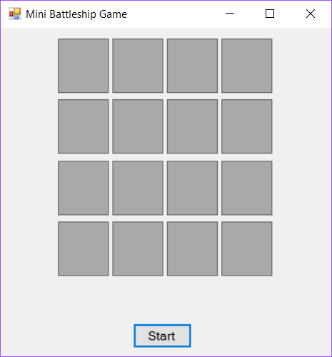
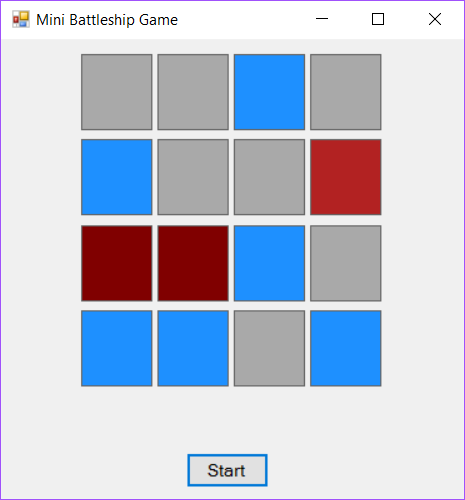
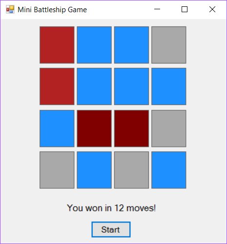

# Mini-Battleship-Game

Program where the user can play the classic Battleship game. In this version of the game, the computer 
will display a 4x4 grid of Labels in the screen, and the user must guess where are the two hidden ships.

Each ship is of size 2 and one lays vertical while the other lays horizontal. They are each displayed by
a different shade of red. Water is obviously displayed by blue. Undiscovered fields are displayed by gray.

The user can click on each of the labels, which will change their background color depending on whether 
there’s a ship or just water under it. The game finishes when the player has uncovered all the ships.

